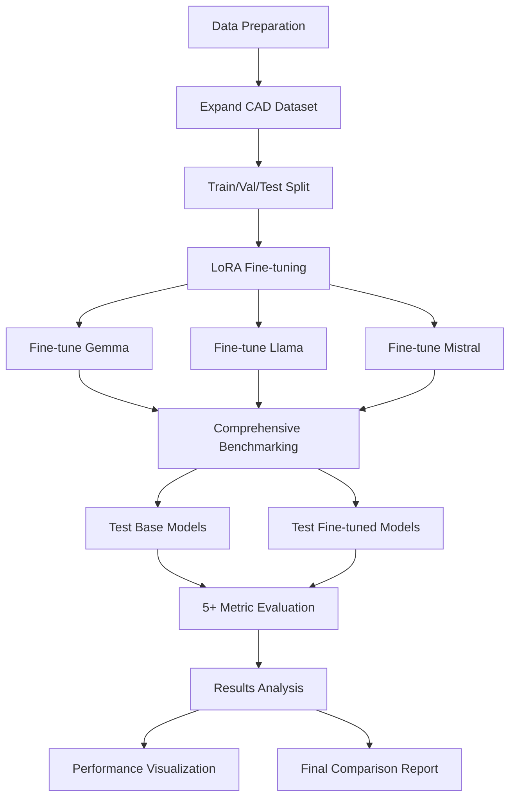

# CAD LLM Training and Benchmarking Pipeline

## Project Structure Enhancement

The pipeline will transform your current basic benchmarking system into a comprehensive training and evaluation framework:

```
CAD-Project/
├── data/
│   ├── datasets/
│   │   ├── cad_dataset.json (existing ~150k cube examples)
│   │   ├── comprehensive_cad_dataset.json (expanded)
│   │   ├── train_split.jsonl (80%)
│   │   ├── val_split.jsonl (10%)
│   │   └── test_split.jsonl (10%)
│   └── prompts/
│       ├── system_prompt.txt
│       └── few_shot_examples.txt
├── training/
│   ├── prepare_training_data.py
│   ├── lora_fine_tuner.py
│   ├── model_configs/
│   └── checkpoints/
├── benchmarking/ (enhanced)
│   ├── run_comprehensive_benchmark.py
│   ├── enhanced_ollama_client.py
│   └── prompt_templates.py
├── evaluation/
│   ├── comprehensive_scoring.py (5+ metrics)
│   ├── results_analyzer.py
│   └── visualization.py
└── utils/
    ├── data_utils.py
    └── openscad_validator.py
```

## Phase 1: Dataset Expansion and Preparation (Week 1)

### Current Dataset Analysis
Your [`cad_dataset.json`](cad_dataset.json) contains ~75k examples, but they're all cube operations. The pattern is consistent:
- Input: "Create a box X by Y by Z"  
- Output: "cube([X, Y, Z]);"

### Dataset Expansion Strategy
Create [`data/prepare_training_data.py`](data/prepare_training_data.py) to:

1. **Augment Existing Data**: Add variations of cube instructions:
   - "Make a rectangular box 5mm x 10mm x 3mm" → "cube([5, 10, 3]);"
   - "Generate a cube with dimensions 2, 4, 6" → "cube([2, 4, 6]);"

2. **Add New CAD Operations**:
   - Cylinders: "Create a cylinder radius 5 height 10" → "cylinder(r=5, h=10);"
   - Spheres: "Make a sphere radius 3" → "sphere(r=3);"
   - Basic Boolean operations: "Union two cubes" → "union() { cube([1,1,1]); cube([2,2,2]); }"

3. **Data Formatting for Training**:
   ```json
   {
     "instruction": "Create a cylinder with radius 5 and height 10",
     "input": "",
     "output": "cylinder(r=5, h=10);"
   }
   ```

4. **Train/Val/Test Splits**: 80/10/10 split with stratification by operation type

## Phase 2: Enhanced Benchmarking System (Week 1)

### Upgrade Current Benchmarking
Transform [`run_benchmark.py`](run_benchmark.py) into [`benchmarking/run_comprehensive_benchmark.py`](benchmarking/run_comprehensive_benchmark.py):

1. **Enhanced Prompt Engineering** in [`benchmarking/prompt_templates.py`](benchmarking/prompt_templates.py):
   ```python
   SYSTEM_PROMPT = """You are an expert OpenSCAD code generator. 
   Generate ONLY valid OpenSCAD code without explanations.
   Rules:
   1. Output only the code, no markdown or explanations
   2. End statements with semicolons
   3. Use exact syntax: cube([x,y,z]); cylinder(r=X,h=Y); sphere(r=Z);
   """
   ```

2. **Improved Model Interface** in [`benchmarking/enhanced_ollama_client.py`](benchmarking/enhanced_ollama_client.py):
   - Add system prompts to model queries
   - Implement response post-processing (strip markdown, explanations)
   - Add response time tracking

### Comprehensive Scoring System
Expand [`scoring.py`](scoring.py) into [`evaluation/comprehensive_scoring.py`](evaluation/comprehensive_scoring.py) with 5+ metrics:

```python
def comprehensive_evaluate(prediction, gold_standard):
    return {
        'codebleu_cad': codebleu_cad_score(prediction, gold_standard),      # 25%
        'syntax_validity': openscad_syntax_score(prediction),               # 20%
        'semantic_accuracy': parameter_accuracy_score(prediction, gold),    # 20%
        'execution_success': openscad_execution_score(prediction),          # 15%
        'response_cleanliness': clean_response_score(prediction),           # 10%
        'geometric_validation': shape_correctness_score(prediction, gold),  # 10%
    }
```

**New Metrics Details**:
- **Syntax Validity**: Parse with OpenSCAD syntax rules
- **Semantic Accuracy**: Extract and compare parameters (dimensions, positions)
- **Execution Success**: Test if code runs without errors in OpenSCAD
- **Response Cleanliness**: Penalize verbose explanations, reward concise code
- **Geometric Validation**: Verify the generated shape matches expected dimensions

## Phase 3: LoRA Fine-tuning Pipeline (Week 2)

### Laptop-Optimized Training Setup
Create [`training/lora_fine_tuner.py`](training/lora_fine_tuner.py) using CPU-friendly approach:

1. **Libraries for CPU Training**:
   - Unsloth (optimized for efficiency)
   - Transformers + PEFT (Parameter Efficient Fine Tuning)
   - 4-bit quantization for memory efficiency

2. **Training Configuration**:
   ```python
   training_config = {
       'model_name': 'microsoft/DialoGPT-small',  # Start with smaller models
       'lora_r': 16,
       'lora_alpha': 32,
       'target_modules': ['q_proj', 'v_proj', 'k_proj', 'o_proj'],
       'learning_rate': 2e-4,
       'batch_size': 2,  # Small for CPU
       'max_steps': 1000,
       'gradient_checkpointing': True,
   }
   ```

3. **Memory Optimization for Laptop**:
   - Use gradient accumulation (effective batch size = 8)
   - Enable gradient checkpointing
   - Process data in chunks
   - Save checkpoints frequently

### Model-Specific Configs
Create configs for each model in [`training/model_configs/`](training/model_configs/):
- `gemma_lora_config.yaml`: Optimized for Gemma 2B
- `llama_lora_config.yaml`: Settings for Llama models
- `mistral_lora_config.yaml`: Mistral-specific parameters

## Phase 4: Pipeline Integration and Automation

### Workflow Orchestration
Create [`run_full_pipeline.py`](run_full_pipeline.py) that:

1. **Prepares Data**: Runs data expansion and splitting
2. **Fine-tunes Models**: Sequential training of all 3 models
3. **Benchmarks Models**: Tests both base and fine-tuned versions
4. **Generates Reports**: Comprehensive comparison analysis

### Results Analysis
Build [`evaluation/results_analyzer.py`](evaluation/results_analyzer.py) to:
- Compare base vs fine-tuned model performance
- Generate performance improvement percentages
- Create visualization of metric improvements
- Export results to JSON/CSV for further analysis



## Expected Resource Usage

**Training Phase** (per model):
- **Time**: 2-4 hours on laptop CPU
- **Memory**: 8-12 GB RAM
- **Storage**: 5-10 GB per fine-tuned model

**Benchmarking Phase**:
- **Time**: 30 minutes for comprehensive evaluation
- **Memory**: 4-6 GB RAM for inference

## Success Metrics

**Target Improvements** (fine-tuned vs base models):
- CodeBLEU-CAD: +20-40%
- Syntax Validity: +50-70% 
- Response Cleanliness: +80-90%
- Overall Composite Score: +30-50%

The pipeline prioritizes quick wins through better prompting and data quality while building toward more sophisticated training techniques.